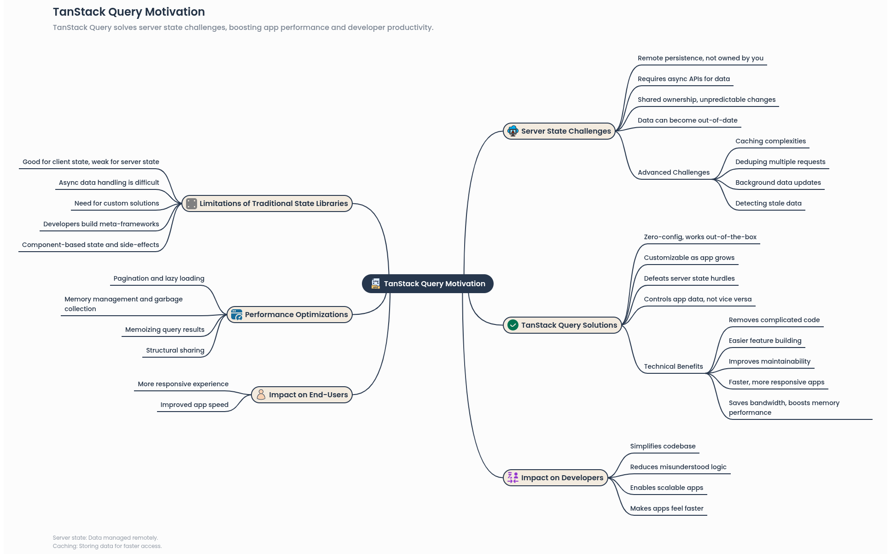

# Overview

> TanStack Query (formerly known as React Query) is often described as the missing data-fetching library for web applications, but in more technical terms, it makes fetching, caching, synchronizing and updating server state in your web applications a breeze.

# Motivation



## TanStack Query What Problems Does It Solve?

- Caching: Caching (probably the hardest task in programming).
- Deduping: Converting multiple requests for the same data into one request.
- Background Updates: Background updates (updating data in the background).
- Staleness: Understanding when data is stale or outdated.
- Fast Updates: Quickly reflecting changes in the data.
- Performance: Performance optimizations like pagination and lazy loading.
- Memory Management: Managing memory and garbage collection for server state.
- Structural Sharing: Sharing data structures to improve performance.

### Client State vs Server State

> Explanation: What we usually do with Redux or useState is 'Client State' (e.g. whether a modal is open or not, or whether dark mode is on or not). But 'Server State' is the data that is stored in the database.

- Example: Suppose you are building an e-commerce site. How many products are in the user's shopping cart is 'Client State', but how much stock of the product is 'Server State'. Because the stock can be reduced at any time by another buyer.

### Data "Out of Date" or Stale

> Explanation: Data starts to become outdated the moment it is fetched from the server.

- Example: You see a Facebook post with a like count of 100. But while you are looking at it, 10 more people have liked it. The data in your browser is now 'out of date'. TanStack Query automatically checks and updates this data in the background.

### Caching

> Explanation: Once the data is fetched, it is stored in memory so that it does not have to send repeated requests to the server.

- Example: You go from the 'Home' page to the 'Profile' page, and then come back to the 'Home' page. TanStack Query will show you the previously fetched data immediately and check in the background for new data. This avoids the user seeing the loading spinner.Explanation: Once the data is fetched, it is stored in memory so that it does not have to send repeated requests to the server.

### Deduping multiple requests

> Explanation: If three different components on a page call the same API at the same time, TanStack Query will send only one request instead of three.

- Example: In a dashboard, the "User Profile" component is in three places—the header, the sidebar, and the main content. Although the code is supposed to fetch it 3 times, TanStack Query cleverly fetches the data only once and distributes it across three places.

### Pagination and Lazy Loading

> Explanation: When there is a lot of data, it is better to break it up into smaller chunks rather than bringing it all together.

- Example: When you scroll down on Facebook, new posts load at the bottom (Infinite Scroll), this complex logic can be done very easily with TanStack Query's useInfiniteQuery.

### Structural Sharing

> Explanation: This is an advanced technique. If new data comes from the server but it turns out that the data has not actually changed, it keeps the old reference in memory. As a result, the React component does not need to be 're-rendered' unnecessarily. This increases the performance of the app many times over. In simple terms, **when new data comes from the server, instead of changing the entire data, only the part that has changed and keeping the reference to the rest of the previous data is called structural sharing.**

### Removing complicated code

> Previously, we used to fetch data using `useEffect`, `useState` (for loading, error, data), which would have become very large.

- Old Code (Traditional):

```jsx
const [data, setData] = useState([]);
const [loading, setLoading] = useState(true);
useEffect(() => {
  fetch("/api/data")
    .then((res) => res.json())
    .then((data) => {
      setData(data);
      setLoading(false);
    });
}, []);
```

- New Code (With TanStack Query):

```jsx
const { data, isLoading } = useQuery({
  queryKey: ["todos"],
  queryFn: fetchTodos,
});
```

### Deduping vs Caching

- Caching: The data has **arrived once and is stored in memory**. The next time you request the data, it is given from memory without going to the server.

- Deduping: The data has **not arrived yet, it is in the process of arriving**. If someone else wants the same data in the middle of that process, the ongoing request is shared without sending a new request.

##### What are its advantages?

1. **Bandwidth saving**: This is great for mobile users, because the same data is not downloaded repeatedly unnecessarily.
1. **Server load reduction**: The server does not have to do the same thing repeatedly.
1. **Data consistency**: The same data is updated at the same time throughout the app. It does not happen that the old data is shown in one place and the new data is shown in another place.

➡️ **Home: [Home](../README.md)**

➡️ **Next Chapter: [Installation_Devtools](./Installation_DevTool.md)**
